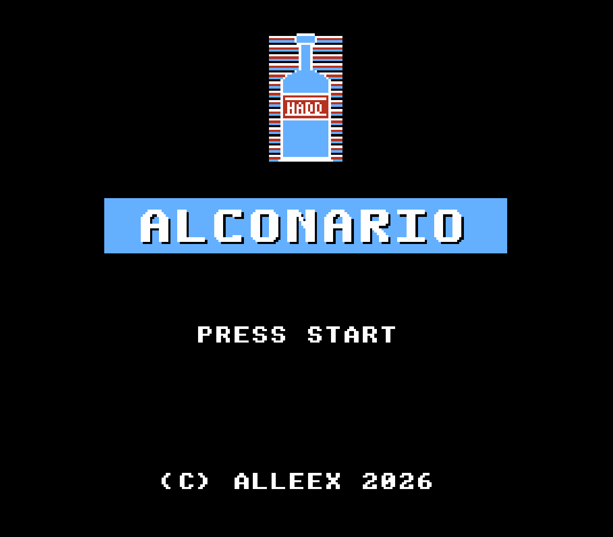

# Alconario 🍄

> *"Every hero needs a friend."*



**Alconario** is a funny real 8-bit NES game starring **Alconario** — the best
friend of Mario, a cheerful guy from a small Belarusian village deep in the
countryside.

While Mario is away on one of his legendary adventures, Alconario has to look
after the village, help the neighbours, dodge trouble, and maybe find a few
surprises along the way.  Pure 8-bit charm, pixel art sunflower fields, and
good old D-pad action — just the way it was meant to be. 🌻

Written in C with **cc65** + **neslib**.

> Target hardware: Nintendo Entertainment System (NTSC, MMC1 / NROM-256 ready)

---

## ✨ Features (planned)

- [x] Project skeleton (cc65 + neslib + famitone2)
- [ ] Title screen
- [ ] Player sprite + controls
- [ ] Scrolling background
- [ ] Enemies & collisions
- [ ] Music & SFX (famitone2)
- [ ] Game over / score

## 🧱 Project layout

```
alconario/
├── assets/              # Game assets (binary or source for tools)
│   ├── chr/             # CHR ROM tiles (.chr) — sprites & background
│   ├── palettes/        # Palette dumps (.pal)
│   ├── music/           # FamiTracker / famitone2 (.ftm, .s)
│   └── levels/          # Level / nametable data
├── cfg/
│   └── nes.cfg          # ld65 linker configuration (NROM by default)
├── include/             # Public C headers
│   ├── game.h
│   ├── input.h
│   ├── player.h
│   └── gfx.h
├── lib/                 # Third-party libs (neslib, famitone2) — vendored
│   └── README.md
├── src/                 # C sources
│   ├── main.c           # Entry point / game loop
│   ├── game.c           # Game state machine
│   ├── input.c          # Pad reading / mapping
│   ├── player.c         # Player logic
│   └── gfx.c            # Rendering helpers
├── src/asm/             # Hand-written 6502 assembly
│   └── chr.s            # CHR-ROM bank embedding
├── tools/               # Helper scripts (asset conversion, packing)
│   └── gen_chr.py       # Generates tiles.chr (bottle art, font, title logo)
├── build/               # Build outputs (gitignored)
├── Makefile
├── .gitignore
└── README.md
```

## 🛠 Prerequisites

Install the **cc65** toolchain (provides `cc65`, `ca65`, `ld65`):

```bash
# macOS
brew install cc65

# Debian / Ubuntu
sudo apt install cc65
```

Get **neslib** (Shiru) and place it under `lib/neslib/`:

```bash
git clone https://github.com/clbr/neslib.git lib/neslib
```

(Or download from https://shiru.untergrund.net/code.shtml)

## � VS Code IntelliSense (optional)

To get header navigation and basic IntelliSense, create
`.vscode/c_cpp_properties.json`:

```jsonc
{
  "configurations": [
    {
      "name": "Mac-cc65",
      "includePath": [
        "${workspaceFolder}/include",
        "${workspaceFolder}/lib/neslib",
        // adjust to your Homebrew prefix:
        //   Apple Silicon: /opt/homebrew/share/cc65/include
        //   Intel Mac:     /usr/local/share/cc65/include
        "/usr/local/share/cc65/include"
      ],
      "defines": ["__CC65__", "__NES__"],
      "cStandard": "c89",
      "intelliSenseMode": "macos-clang-arm64"
    }
  ],
  "version": 4
}
```

> **Note:** cc65 is not a clang-compatible compiler, so IntelliSense won't
> understand all cc65-specific constructs — but "Go to Definition" and header
> navigation will work fine.

## 🚀 Build & run

```bash
# Generate CHR tile data and build the ROM
python3 tools/gen_chr.py && make clean && make

# Or step by step:
make gen        # regenerate assets/chr/tiles.chr (requires Python 3)
make            # build build/alconario.nes
make run        # build and launch in an emulator (FCEUX by default)
make clean      # remove build artifacts
```

Override the emulator:

```bash
make run EMU=mesen
```

## 📜 License

[MIT](LICENSE) — free and open-source, do whatever you want with it.

## 🤝 Contributing

Contributions are very welcome! Read [CONTRIBUTING.md](CONTRIBUTING.md) to get started — bug fixes, pixel art, music, levels, docs, all appreciated. 🌻

## 👤 Authors

Created by **Aliaksandr Kavalenka** and AI friends. 🤖
